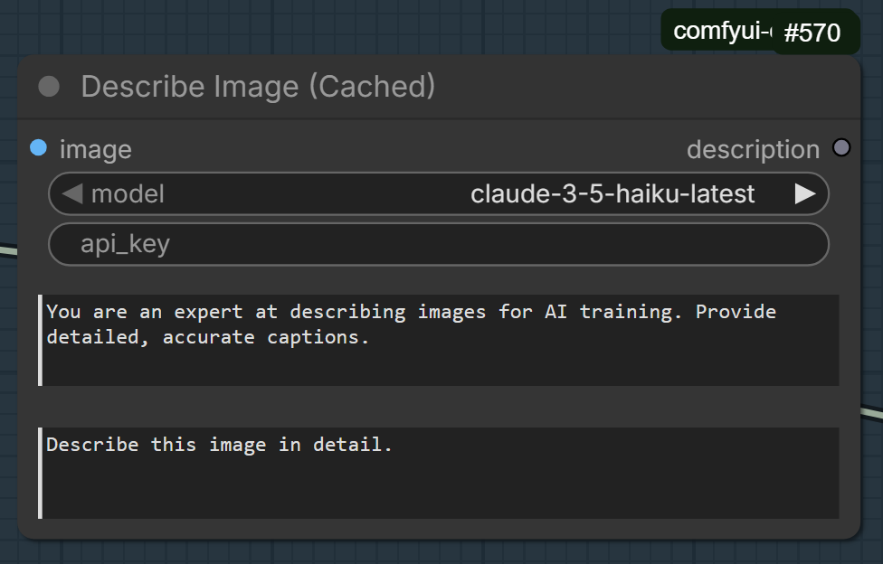

# ComfyUI and Claude
A set of custom nodes that use Anthropic's Claude models for describing images and transforming texts.

## Fork Information

This is a fork of [harelc/comfyui-claude](https://github.com/harelc/comfyui-claude), which itself is based on the original work by [tkreuziger](https://github.com/tkreuziger/comfyui-claude). 

### Changes in This Fork

- **Updated Claude models**: All current Claude 4 models as of June 2026 (Opus 4.8, 4.7, 4.6, Sonnet 4.6, Sonnet 4.5, Haiku 4.5). Retired models removed.
- **Prompt caching support**: New DescribeImage (Cached) node for cost-effective batch image captioning
- **Improved error handling**: Better error messages and authentication feedback

## Setup

Clone this repository into your ComfyUI custom nodes folder and install the requirements:

```bash
cd ComfyUI/custom_nodes
git clone https://github.com/stevehooker/comfyui-claude.git
cd comfyui-claude
pip install -r requirements.txt
```

Then restart ComfyUI.

Alternatively, if you're using ComfyUI Manager, you can install the original version from the package registry and then manually update to this fork.

## Requirements

You need an Anthropic API key that you must fill in the nodes. Learn more about
this [here](https://docs.anthropic.com/en/api/getting-started).

## Included nodes

1. **DescribeImage**: Takes an image as input and returns a textual description of it.
2. **DescribeImage (Cached)**: Optimised version for batch image captioning that uses prompt caching to reduce costs by up to 90% when processing multiple images with the same system prompt. Ideal for generating captions for LoRA training datasets.
3. **CombineTexts**: Combine two texts into something new with the help of Claude.
4. **TransformText**: Transforms an input text into some other text, ideal for rephrasing prompts or similar.

## Supported Models

This fork includes support for all current Claude models (updated June 2026):

| Model | API string | Notes |
|-------|-----------|-------|
| Claude Opus 4.8 | `claude-opus-4-8` | Latest flagship — May 2026 |
| Claude Opus 4.7 | `claude-opus-4-7` | April 2026 |
| Claude Opus 4.6 | `claude-opus-4-6` | February 2026 |
| Claude Sonnet 4.6 | `claude-sonnet-4-6` | Best balance of speed/intelligence |
| Claude Sonnet 4.5 | `claude-sonnet-4-5-20250929` | Active until at least Sept 2026 |
| Claude Haiku 4.5 | `claude-haiku-4-5-20251001` | Fast and cost-effective |

> **Note**: Several older models have been retired by Anthropic and are no longer available via the API. The `claude-sonnet-4-20250514`, `claude-3-opus-20240229`, and `claude-3-5-haiku-20241022` strings will return errors if used — they have been removed from this fork.

## Prompt Caching

The **DescribeImage (Cached)** node implements [Anthropic's prompt caching](https://docs.anthropic.com/en/docs/build-with-claude/prompt-caching) feature, which caches your system prompt across multiple API calls.



### Where to Put Your Text

The node has two text input fields:

**1. First Text Box (System Prompt) — THIS GETS CACHED ✨**

```
You are an expert at describing images for AI training. Provide detailed, accurate captions.
```

This is where you put your **consistent captioning instructions** that apply to ALL images in your batch. This is what gets cached, so make it detailed!

Example:
```
You are an expert at describing images for AI training. Provide detailed, accurate captions that include:
- The main subject and their appearance
- Actions or poses
- Setting and background details
- Lighting and atmosphere
- Art style or medium
- Camera angle and composition

Focus on objective, descriptive language suitable for training image generation models.
```

**2. Second Text Box (Prompt) — Per-image instruction**

```
Describe this image in detail.
```

This is your per-image prompt. It can stay the same for all images, or vary it slightly if needed. This doesn't get cached, but it's typically much shorter.

### How Caching Works

- **First API call**: System prompt is sent and cached (full cost)
- **Subsequent calls**: System prompt is retrieved from cache (10% cost)
- **Result**: You pay full price for the detailed system prompt once, then a 90% discount for subsequent images

This is particularly useful when:

- Processing batches of images with consistent captioning instructions
- Generating training data for LoRA models
- Running repetitive image analysis tasks

## Credits

- Original work by [tkreuziger](https://github.com/tkreuziger/comfyui-claude)
- Forked from [harelc](https://github.com/harelc/comfyui-claude)
- Extended by [stevehooker](https://github.com/stevehooker/comfyui-claude)
